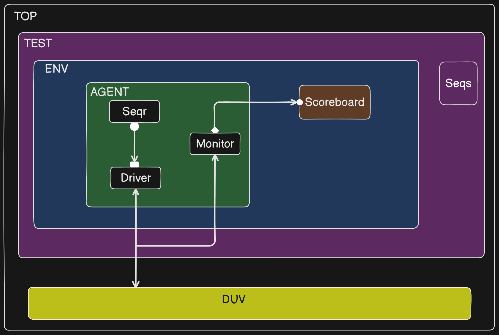

# Logic Gates UVM Verification

This repository contains a complete UVM-based verification environment for basic logic gates (AND, OR, XOR, NAND, NOR, XNOR, NOT, BUFFER). The testbench is designed to verify the functionality of all logic operations and provide comprehensive coverage.

## Project Structure

```
logic_gates_uvm/
├── rtl/
│   └── logic_gates.sv
│   └── gate_if.sv 
├── agent_top/
│   ├── seq_item.sv
│   ├── base_seqs.sv
│   ├── sequencer.sv
│   ├── driver.sv
│   ├── monitor.sv
│   ├── scoreboard.sv
│   └──agent.sv
└── sim/
│    └── Makefile
└── test/
│     ├── base_test.sv
│     └──gate_pkg.sv
└── tb/
    ├── env.sv
    ├── scoreboard.sv
    └── top.sv

```

## UVM TB


## Mode Definitions
- Mode 0: AND Gate
- Mode 1: OR Gate
- Mode 2: XOR Gate
- Mode 3: NAND Gate
- Mode 4: NOR Gate
- Mode 5: XNOR Gate
- Mode 6: BUF Gate
- Mode 7: NOT Gate

### UVM Components

#### 1. Transaction Class (seq_item.sv)
- Defines the transaction items containing input and output signals
- Implements randomization for input signals
- Includes UVM field macros for automation

#### 2. Sequence (sequence.sv)
- Generates random test scenarios
- Implements specific test cases for corner cases
- Controls the stimulus generation flow

#### 3. Driver (driver.sv)
- Converts transaction-level items to pin-level signals
- Drives the DUT interface according to the protocol

#### 4. Monitor (monitor.sv)
- Samples the DUT interface
- Converts pin-level activity to transaction-level items
- Sends transactions to scoreboard for verification

#### 5. Scoreboard (scoreboard.sv)
- Implements the reference model
- Compares DUT output with expected results
- Reports any mismatches or errors

## Test Scenarios

1. **Random Testing**
   - Random combinations of inputs
   - Full coverage of all possible input combinations

2. **Directed Testing**
   - Specific test cases for each gate
   - Corner cases testing
   - All-zeros and all-ones testing

3. **Coverage Goals**
   - 100% functional coverage of all input combinations
   - 100% code coverage of RTL
   - Toggle coverage of all signals


## Requirements
1. QuestaSim/ModelSim for simulation
2. UVM 1.2 or later
3. SystemVerilog supported simulator
4. VCS/Questa verification platforms

## Contributing

1. SystemVerilog community members
2. Open source verification resources
3. UVM resources
